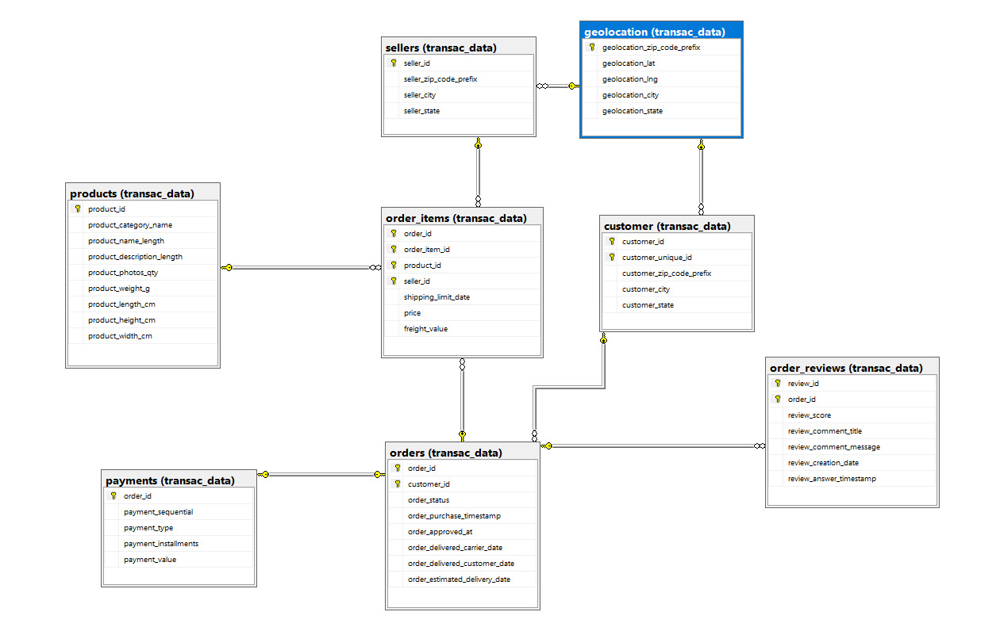
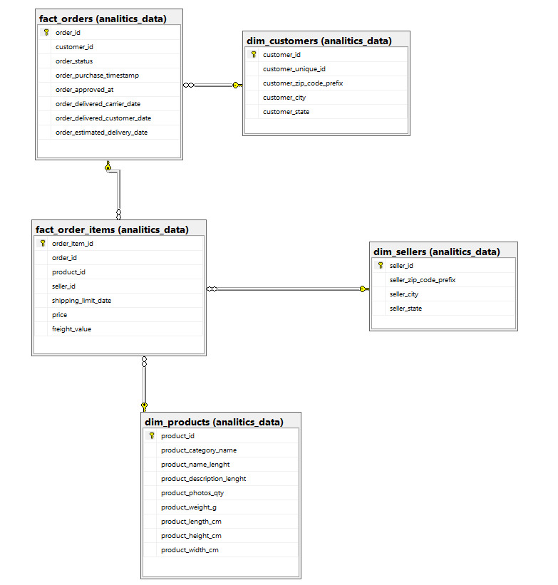

### MBA Engenharia de Dados
### Universidade Presbiteriana Mackenzie
### Matéria: Data Prep & Transformation

# Ecommerce's Vini Show Brasil
Este trabalho mostra como desenvolver um fluxo completo de preparação e transformação de dados de um conjunto de dados brutos de um e-commerce brasileiro. O código e os arquivos gerados encontram-se disponíveis neste repositório para consulta e replicação.

---

## Integrantes

|Nome               |
|----               |
|Henrique Arduini   |
|Mônica Dyna        |
|Renato Mori        |
|Vinícius Soares    |

## Desafio
1. Na primeira etapa criar o banco de dados transcional com base na documentação disponível em https://www.kaggle.com/datasets/olistbr/brazilian-ecommerce, assim como um fluxo para realizar o carregamento dos dados neste banco de dados.

2. Criar um modelo lógico e físico Star Schema e Wide Table para crição de um banco de dados analítico (cada um em um banco de dados diferente).

3. Criar um fluxo, baseado em uma carga incial dos dados brutos para dados especialistas (Start Schema e Wide Table).

4. Definir e tornar clara a escolha entre as abordagens de Batch, Micro-Batch ou Fluxo Contínuo.

## Divisão de tarefas
- **Criação do dockerfile do projeto**
    - Responsáveis - Vinicíus Soares e Renato Mori

- **Criação do banco transacional**
    - Responsável - Renato Mori

- **Criação do modelo do banco transacional**
    - Responsáveis - Mônica Dyna e Henrique Arduini

- **Ingestão os dados para o modelo transacional**
    - Responsável - Vinicíus Soares
---
- **Criação do banco analítico**
    - Responsável - Renato Mori

- **Criação do modelo do banco analítico**
    - Responsáveis - Henrique Arduini e Mônica Dyna

- **Ingestão os dados para o modelo analítico**
    - Responsável - Vinicíus Soares
---
- **Documentação do projeto: README.md**
    - Responsáveis - Todos

- **Documentação do código e scripts**
    - Responsáveis - Todos

    
## Solução

### 1. Documentação das tabelas transacionais
## Tabelas Transacionais

### Costumers

| Column                     | Data Type          | Constraints         |
|----------------------------|--------------------|---------------------|
| customer_id                | VARCHAR(32)        | UNIQUE, NOT NULL    |
| customer_unique_id         | VARCHAR(32)        | UNIQUE, NOT NULL    |
| customer_zip_code_prefix   | VARCHAR(7)         |                     |
| customer_city              | VARCHAR(50)        |                     |
| customer_state             | CHAR(2)            |                     |
| PRIMARY KEY (customer_id, customer_unique_id) |
| FOREIGN KEY (customer_zip_code_prefix) REFERENCES transac_data.geolocation(geolocation_zip_code_prefix) |

### Geolocation

| Column                     | Data Type          | Constraints         |
|----------------------------|--------------------|---------------------|
| geolocation_zip_code_prefix| VARCHAR(7)         | PRIMARY KEY         |
| geolocation_lat            | DECIMAL(8, 6)      |                     |
| geolocation_lng            | DECIMAL(9, 6)      |                     |
| geolocation_city           | VARCHAR(50)        |                     |
| geolocation_state          | CHAR(2)            |                     |

### Order Items

| Column                     | Data Type          | Constraints         |
|----------------------------|--------------------|---------------------|
| order_id                   | VARCHAR(32)        | NOT NULL            |
| order_item_id              | INT                |                     |
| product_id                 | VARCHAR(32)        |                     |
| seller_id                  | VARCHAR(32)        |                     |
| shipping_limit_date        | DATETIME           |                     |
| price                      | DECIMAL(7, 2)      |                     |
| freight_value              | DECIMAL(6, 2)      |                     |
| PRIMARY KEY (order_id, order_item_id, product_id, seller_id) |
| FOREIGN KEY (seller_id) REFERENCES transac_data.sellers(seller_id) |
| FOREIGN KEY (product_id) REFERENCES transac_data.products(product_id) |
| FOREIGN KEY (order_id) REFERENCES transac_data.orders(order_id) |

### Order Payments

| Column                     | Data Type          | Constraints         |
|----------------------------|--------------------|---------------------|
| order_id                   | VARCHAR(32)        | PRIMARY KEY         |
| payment_sequential         | INT                |                     |
| payment_type               | VARCHAR(20)        |                     |
| payment_installments       | INT                |                     |
| payment_value              | DECIMAL(10, 2)     |                     |
| FOREIGN KEY (order_id) REFERENCES transac_data.orders(order_id) |

### Order Reviews 

| Column                     | Data Type          | Constraints         |
|----------------------------|--------------------|---------------------|
| review_id                  | VARCHAR(32)        | NOT NULL            |
| order_id                   | VARCHAR(32)        | NOT NULL            |
| review_score               | INT                |                     |
| review_comment_title       | VARCHAR(50)        |                     |
| review_comment_message     | VARCHAR(255)       |                     |
| review_creation_date       | DATE               |                     |
| review_answer_timestamp    | DATETIME           |                     |
| PRIMARY KEY (review_id, order_id) |
| FOREIGN KEY (order_id) REFERENCES transac_data.orders(order_id) |

### Orders 

| Column                     | Data Type          | Constraints         |
|----------------------------|--------------------|---------------------|
| order_id                   | VARCHAR(32)        | UNIQUE, NOT NULL    |
| customer_id                | VARCHAR(32)        | NOT NULL            |
| order_status               | VARCHAR(20)        |                     |
| order_purchase_timestamp   | DATETIME           |                     |
| order_approved_at          | DATETIME           |                     |
| order_delivered_carrier_date | DATETIME         |                     |
| order_delivered_customer_date | DATETIME        |                     |
| order_estimated_delivery_date | DATE            |                     |
| PRIMARY KEY (order_id, customer_id) |
| FOREIGN KEY (customer_id) REFERENCES transac_data.customer(customer_id) |

### Products

| Column                     | Data Type          | Constraints         |
|----------------------------|--------------------|---------------------|
| product_id                 | VARCHAR(32)        | PRIMARY KEY         |
| product_category_name      | VARCHAR(50)        |                     |
| product_name_length        | INT                |                     |
| product_description_length | INT                |                     |
| product_photos_qty         | INT                |                     |
| product_weight_g           | INT                |                     |
| product_length_cm          | INT                |                     |
| product_height_cm          | INT                |                     |
| product_width_cm           | INT                |                     |

### Sellers

| Column                     | Data Type          | Constraints         |
|----------------------------|--------------------|---------------------|
| seller_id                  | VARCHAR(32)        | PRIMARY KEY         |
| seller_zip_code_prefix     | VARCHAR(7)         |                     |
| seller_city                | VARCHAR(50)        |                     |
| seller_state               | CHAR(2)            |                     |
| FOREIGN KEY (seller_zip_code_prefix) REFERENCES transac_data.geolocation(geolocation_zip_code_prefix) |

### Product Category Name

| Column                     | Data Type          | Constraints         |
|----------------------------|--------------------|---------------------|
| id                         | INT                | IDENTITY, PRIMARY KEY |
| product_category_name      | VARCHAR(50)        | NOT NULL            |
| product_category_name_english | VARCHAR(50)     |                     |

## Tabelas Star Schema

### Dim Customers

| Column                   | Data Type   | Constraints       |
|--------------------------|-------------|-------------------|
| customer_id              | VARCHAR(32) | PRIMARY KEY       |
| customer_unique_id       | VARCHAR(32) | UNIQUE, NOT NULL  |
| customer_zip_code_prefix | VARCHAR(7)  |                   |
| customer_city            | VARCHAR(50) |                   |
| customer_state           | CHAR(2)     |                   |

### Dim Products

| Column                     | Data Type   | Constraints       |
|----------------------------|-------------|-------------------|
| product_id                 | VARCHAR(32) | PRIMARY KEY       |
| product_category_name      | VARCHAR(50) |                   |
| product_name_lenght        | INT         |                   |
| product_description_lenght | INT         |                   |
| product_photos_qty         | INT         |                   |
| product_weight_g           | INT         |                   |
| product_length_cm          | INT         |                   |
| product_height_cm          | INT         |                   |
| product_width_cm           | INT         |                   |

### Dim Sellers

| Column                   | Data Type   | Constraints       |
|--------------------------|-------------|-------------------|
| seller_id                | VARCHAR(32) | PRIMARY KEY       |
| seller_zip_code_prefix   | VARCHAR(7)  |                   |
| seller_city              | VARCHAR(50) |                   |
| seller_state             | CHAR(2)     |                   |

### Fact Orders

| Column                         | Data Type   | Constraints                          |
|--------------------------------|-------------|--------------------------------------|
| order_id                       | VARCHAR(32) | PRIMARY KEY                          |
| customer_id                    | VARCHAR(32) |                                      |
| order_status                   | VARCHAR(20) |                                      |
| order_purchase_timestamp       | DATETIME2   |                                      |
| order_approved_at              | DATETIME2   |                                      |
| order_delivered_carrier_date   | DATETIME2   |                                      |
| order_delivered_customer_date  | DATETIME2   |                                      |
| order_estimated_delivery_date  | DATETIME2   |                                      |
| FOREIGN KEY (customer_id) REFERENCES analitics_data.dim_customers(customer_id) |

### Dim Order Items

| Column              | Data Type   | Constraints                            |
|---------------------|-------------|----------------------------------------|
| order_item_id       | VARCHAR(32) | PRIMARY KEY                            |
| order_id            | VARCHAR(32) | NOT NULL                               |
| product_id          | VARCHAR(32) | NOT NULL                               |
| seller_id           | VARCHAR(32) | NOT NULL                               |
| shipping_limit_date | TIMESTAMP   |                                        |
| price               | DECIMAL(10, 2) |                                      |
| freight_value       | DECIMAL(10, 2) |                                      |
| FOREIGN KEY (order_id) REFERENCES fact_orders(order_id)                  |
| FOREIGN KEY (product_id) REFERENCES dim_products(product_id)             |
| FOREIGN KEY (seller_id) REFERENCES dim_sellers(seller_id)                |

## Wide Table

| Column                         | Data Type          |
|--------------------------------|--------------------|
| order_id                       | VARCHAR(32)        |
| customer_id                    | VARCHAR(32)        |
| customer_unique_id             | VARCHAR(32)        |
| customer_zip_code_prefix       | VARCHAR(7)         |
| customer_city                  | VARCHAR(50)        |
| customer_state                 | CHAR(2)            |
| order_status                   | VARCHAR(20)        |
| order_purchase_timestamp       | DATETIME           |
| order_approved_at              | DATETIME           |
| order_delivered_carrier_date   | DATETIME           |
| order_delivered_customer_date  | DATETIME           |
| order_estimated_delivery_date  | DATE               |
| order_item_id                  | INT                |
| product_id                     | VARCHAR(32)        |
| product_category_name          | VARCHAR(50)        |
| product_name_length            | INT                |
| product_description_length     | INT                |
| product_photos_qty             | INT                |
| product_weight_g               | INT                |
| product_length_cm              | INT                |
| product_height_cm              | INT                |
| product_width_cm               | INT                |
| seller_id                      | VARCHAR(32)        |
| seller_zip_code_prefix         | VARCHAR(7)         |
| seller_city                    | VARCHAR(50)        |
| seller_state                   | CHAR(2)            |
| shipping_limit_date            | DATETIME           |
| price                          | DECIMAL(7, 2)      |
| freight_value                  | DECIMAL(6, 2)      |

### Modelagem transacional

### Modelagem Star Schema

## Conclusão
Este trabalho apresentou o desenvolvimento de um fluxo completo de preparação e transformação de dados a partir de um conjunto de dados brutos de um e-commerce brasileiro. Durante o processo, foram aplicadas técnicas de manipulação e análise de dados, com foco nos seguintes pontos:

Relacionamento de tabelas: Criamos o relacionamento entre as tabelas do diagrama fornecido, preservando todas as linhas da tabela Produto, garantindo que nenhum dado relevante fosse perdido no processo.
Filtragem de dados: Aplicamos um filtro na tabela Produto para selecionar apenas as linhas em que o campo MakeFlag possui valor igual a 0, restringindo a análise a produtos específicos conforme solicitado.
Geração de arquivos agregados: Foi gerado um arquivo Excel contendo informações agregadas por categoria e quantidade de produtos distintos, facilitando a análise de padrões e tendências por categoria.
Consolidação de informações: Criamos um arquivo CSV unificado com todas as informações das três tabelas, eliminando colunas repetidas ou redundantes (chaves estrangeiras) para simplificar a visualização e análise dos dados.

## Aprendizados e Impactos
Este desafio possibilitou a prática de habilidades essenciais em engenharia de dados, como criação de relacionamentos, filtragem criteriosa, transformação de dados e exportação para formatos práticos e acessíveis. O resultado final permitiu obter informações relevantes para a análise estratégica do e-commerce, promovendo insights acionáveis para tomadas de decisão.

Com este trabalho, foi demonstrada a importância de um pipeline de dados bem estruturado, que conecta dados brutos a resultados concretos e utilizáveis. Além disso, o uso das ferramentas certas e boas práticas contribuiu para a consistência e qualidade dos dados transformados.
